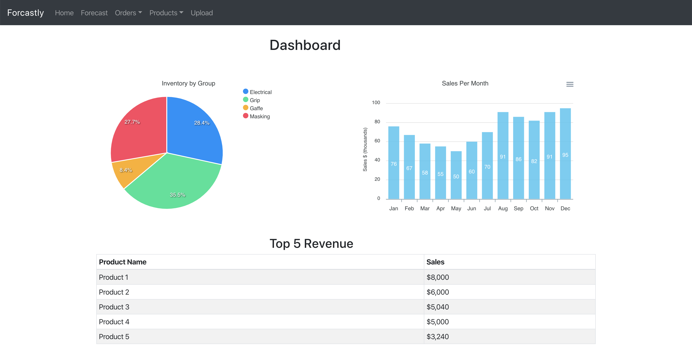

# 4castly
4castly is an inventory management and forecasting application written with:
* React.js
* Node.js
* Express.js
* MySQL as the database
* Sequelize ORM

The application also leverages a few libraries: 
* ApexCharts for React
* React Bootstrap

